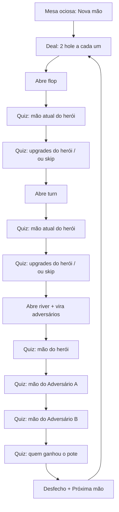

# PRD — Poker Trainer

> Fonte da verdade **funcional**. Descreve comportamento esperado, não arquitetura.
> Última atualização: 2026-09-07
> Contexto: [context.md](context.md)

## 1. Visão do produto

O Poker Trainer é um simulador de **uma mesa de Texas Hold’em com três jogadores** cujo único jogo é a leitura. Não se aposta. Não se paga blind. Não se folda. A cada rodada o software embaralha, distribui, vira flop, turn e river e interroga o usuário em múltipla escolha: o que ele já tem, o que ainda pode ter, o que cada um completou no showdown e quem leva o pote.

O usuário é um jogador amador que, na mesa presencial, congela na leitura. O produto existe para repetir esse instante — cartas no feltro, adversários sentados, comunitárias abrindo — até a identificação ficar automática. Por isso a interface **não pode parecer um quiz com baralho colado ao lado**: tem de parecer uma mesa de poker online, com o questionário integrado ao feltro, no mesmo lugar onde um client de poker colocaria ações ou o chat.

O motor avalia mãos com ranking completo (incluindo kickers e empates) para decidir o pote com justiça. O treino visível ao usuário, no MVP, pede só a **categoria** da mão (par, flush, full house, etc.). Melhorar *dentro* da mesma categoria (par de 2 para par de Ás) **não** conta como upgrade no quiz.

**Não há fase preflop de perguntas.** Depois do deal das hole cards, a mesa abre o flop e só então o HUD pergunta. No river, a mão do herói é perguntada **uma vez**, já no showdown (não se repete a pergunta da seção 5.3).

## 2. Objetivos e métricas

| Objetivo | Métrica | Meta |
|----------|---------|------|
| Acelerar identificação da mão feita | Acurácia na 1ª tentativa por categoria | Tendência de alta com o volume de mãos |
| Acelerar leitura de upgrades possíveis | Acurácia na 1ª tentativa por categoria na pergunta de “ainda possível” | Tendência de alta |
| Acelerar leitura de showdown | Acurácia na 1ª tentativa nas mãos dos três jogadores e no vencedor | Tendência de alta |
| Manter imersão | A sessão inteira ocorre sobre a mesa, sem telas que “saiam do clube” | Fluxo flop → river sem quebrar o layout da mesa |

## 3. Escopo

### 3.1 Incluído

- Mesa visual de Texas Hold’em com herói + 2 adversários.
- Embaralhamento de alta entropia e deal animado.
- Quiz no flop, no turn e no river/showdown; múltipla escolha com até 6 opções (sempre tentando 6).
- Retry até acertar, com opção errada desabilitada.
- Persistência da evolução por categoria (1ª tentativa), sem tela de relatório.
- Resultado da rodada + **Próxima mão**.
- Empate / pote dividido.
- Som suave, avatares, fichas decorativas, animações de carta.

### 3.2 Excluído

- Qualquer ação de aposta ou estratégia (blinds, raise, fold, side pot).
- Quiz **preflop** (antes do flop abrir).
- Draws nomeados (gutshot, flush draw, etc.).
- Enunciado com kickers ou “par de ases”.
- Upgrade *dentro* da mesma categoria (par mais forte, flush mais alto).
- Relatório/gráficos de evolução; botão de zerar estatísticas (limpar dados do site no navegador basta).
- Controle de mute/volume na UI (se o browser bloquear o áudio, a mesa segue muda).
- Desistir da mão em curso (só completar ou recarregar a página).
- Conta, nuvem, multiplayer, outras variantes de poker.

## 4. Personas e permissões

| Persona | Permissões / Ações permitidas |
|---------|------------------------------|
| Treinando (único papel) | Iniciar rodada, responder quizzes, pedir próxima mão, ouvir/ver a mesa. Não há login. Os dados de evolução pertencem a este navegador. |

## 5. Funcionalidades

> **Seção obrigatória.** Fonte do `speckit-roadmap.md`.

### Fluxo canônico de uma mão

Cada caixa de quiz só avança depois de acerto (com retry). Não existe pergunta entre o deal e o flop.

---

### 5.1 Mesa imersiva e sessão de treino

**Objetivo:** Fazer o treino acontecer *dentro* de uma mesa de poker online, não ao lado dela. Esta funcionalidade define o casco visual e o ciclo de uma sessão.

**Diretriz de UX (obrigatória):** a tela principal é uma **mesa**. Feltro oval, rail, posições, cartas, avatares e um pote de fichas decorativo. Perguntas, feedback e o botão **Próxima mão** entram como **HUD da própria mesa** (faixa inferior / painel sobre o feltro), no estilo da barra de ações de um client de poker — nunca como `alert()`, nunca como formulário branco de site institucional, nunca como cartões de “questionário escolar” flutuando soltos sobre um fundo genérico.

**Estados do HUD (obrigatório):**

| Estado | Quando | O que o HUD mostra |
|--------|--------|---------------------|
| `ociosa` | App aberto, após reload no meio da mão, ou após o usuário ainda não ter iniciado | Uma linha de propósito + CTA **Nova mão** |
| `deal` | Cartas voando | Sem opções clicáveis (não dispara quiz em cima do deal) |
| `perguntando` | Street aberta, quiz ativo | Enunciado + até 6 opções |
| `sem_upgrade` | RN-020 vazio no flop/turn | Frase de que não há upgrade + **Continuar** |
| `resultado` | Vencedor acertado | Quem levou o pote, as 3 categorias já identificadas, **Próxima mão** |

**Fluxo principal:**
1. O usuário abre o app e vê a mesa ociosa: três assentos ocupados, slots de comunitárias vazios, pote decorativo, CTA **Nova mão**.
2. Ao iniciar, o deal das hole cards acontece na mesa (ver 5.2). **Ainda não há pergunta.**
3. Em seguida abre o flop; só então o HUD entra em `perguntando` com o quiz do flop (5.3 → 5.4).
4. Após o flop completo, abre o turn e o quiz do turn (5.3 → 5.4).
5. Após o turn completo, abre o river, as hole cards dos adversários viram no lugar (showdown) e o HUD segue a sequência 5.5.
6. Ao acertar quem ganhou, o HUD vai a `resultado` e o botão **Próxima mão** inicia um novo deal na mesma mesa, sem reload perceptível da página.

**Fluxos alternativos:**
- Primeira visita e toda mesa `ociosa`: uma linha (“Treine ler as mãos. Sem apostas.”). Não há wizard.
- Recarregar no meio da mão: a mão em curso perde-se; a evolução persistida permanece; HUD volta a `ociosa`.

**Fluxos de exceção:**
- Áudio bloqueado: mesa muda; treino segue; sem modal agressivo.
- Animações pesadas: cartas ainda devem chegar aos lugares certos; o quiz só habilita **depois** de pousarem (ver ritmo abaixo).

**Regras de negócio:**
- RN-001: Variante fixa: Texas Hold’em. Cada jogador recebe **2 hole cards** (privadas; fechadas para os outros). O board tem **5 comunitárias** (flop 3, turn 1, river 1). “Fechadas” em RN-001 refere-se ao padrão Hold’em, não a esconder as cartas do herói de si mesmo (ver RN-006).
- RN-002: Sempre **3 jogadores**: Herói (usuário, assento inferior, frente à câmera), Adversário A e Adversário B. Sem assentos vazios no MVP.
- RN-003: Não há apostas, blinds, dealer button funcional, timer de ação nem fold. Fichas e pote são **cenografia** (sem valor em bb). No split, o bolo de fichas divide-se visualmente — não há contas.
- RN-004: Idioma da UI: português. Termos de clube (flop, turn, river, showdown) podem permanecer em inglês, com rótulo claro. Os **10 nomes de categoria do quiz** são os de RN-014, sem sinônimos na UI (não misturar “Sequência” e “Straight”).
- RN-005: Cartas dos adversários permanecem **fechadas** até o início do showdown (river aberto + virada).
- RN-006: O herói vê as próprias hole cards desde o fim do deal (abertas no assento inferior).
- RN-007: Desktop é o layout de referência. Tablet: mesa + HUD sem cortar cartas. Celular no MVP: HUD pode empilhar abaixo; cartas ainda legíveis; imersão não precisa igualar o desktop.
- RN-041: **Não há quiz preflop.** Nenhuma pergunta ocorre com o board ainda vazio.
- RN-042: Não há CTA “Desistir” / “Nova mão” durante uma mão em curso. Abandonar = recarregar a página.
- RN-043: Labels de CTA: mesa ociosa = **Nova mão**; após o desfecho = **Próxima mão**. Não usar “Embaralhar” como nome de botão.

**Casos de erro:**

| Situação | Comportamento esperado |
|----------|------------------------|
| Áudio bloqueado pelo navegador | Mesa muda; treino segue; sem modal de erro agressivo |
| Tela estreita demais | HUD desce; cartas da mesa não devem sobrepor-se até ficarem ilegíveis |
| Recarregar no meio da mão | Volta à mesa ociosa; evolução já persistida não some |

**Critérios de aceitação:**
- [ ] CA-001: Dado o app aberto no desktop em estado ocioso, quando o usuário vê a tela, então há feltro, três assentos com avatar/nome, slots de comunitárias e CTA **Nova mão** — sem opções de quiz ainda.
- [ ] CA-002: Dado o flop acabou de pousar, quando o HUD pergunta, então as três cartas estão no centro, as opções estão habilitadas, e o enunciado é o da mão atual do herói.
- [ ] CA-003: Dado o flop/turn, quando se olha os assentos adversários, então as hole cards deles estão viradas para baixo.
- [ ] CA-004: Dado o início do showdown, quando a primeira pergunta do river aparece, então as hole cards dos dois adversários estão abertas nos respectivos assentos.
- [ ] CA-005: Dado o fim da rodada, quando o usuário aciona **Próxima mão**, então a mesa permanece, as cartas são recolhidas e uma nova mão é distribuída (de novo sem quiz preflop).
- [ ] CA-026: Dado o deal em andamento, quando as hole cards ainda voam, então o HUD **não** apresenta opções clicáveis.

**UI/UX desta funcionalidade (detalhe de produto):**

- **Feltro:** verde-mesa profundo (não “verde lima de clipart”), rail em madeira ou borracha escura, vinco oval, iluminação que simula holofote no centro (comunitárias no ponto mais claro). A mesa deve parecer clube, não planilha.
- **Cartas:** baralho clássico de poker, índices grandes e contrastados, naipes vermelho/preto inequívocos, verso padronizado (único verso para cartas fechadas). Tamanho suficiente para ler rank e naipe a ~70 cm do monitor. Nunca usar emojis nem caracteres Unicode de baralho (U+1F0A0…) como carta principal.
- **Assentos:** cada jogador tem avatar (ilustração ou ficha de personagem, não foto de pessoa real), apelido estável (**Você**, **Adversário A**, **Adversário B**) e um pequeno stack de fichas decorativo. O herói é visualmente “o lugar do player” (maior, mais perto, HUD ancorado nele).
- **Board:** as cinco comunitárias têm slots fixos no centro (três do flop já alinhados; turn e river entram nos slots 4 e 5). Slots vazios visíveis antes da street, como em clients de poker.
- **HUD:** tipografia de UI nítida sobre fundo escuro/translúcido, alto contraste, uma pergunta por vez, opções em botões grandes clicáveis. Estado: padrão, hover, foco teclado, selecionado, correto, errado-desabilitado. Feedback de acerto/erro é uma reação da mesa (flash no HUD, som curto, texto “Você acertou” / “Não é essa. Tente de novo.”) — não um popup do browser.
- **Movimento:** deal em leque/deslize até o assento; flop abre as três em sequência rápida; turn e river podem “queimar” visualmente (verso teatral, depois a street abre) de forma breve. O quiz só habilita depois das cartas da street pousarem. Teto: ~1 s de animação por street depois da primeira mão da sessão (a primeira pode ser um pouco mais lenta). “Não travar a UI” ≠ “permitir clique enquanto a carta ainda voa”.
- **Som (MVP):** mix baixo; se o browser bloquear, segue mudo. Eventos: shuffle, deal, flop, virada de showdown, acerto, erro. Sem trilha contínua. Sem botão de mute no MVP.
- **O que não fazer:** fundo branco de landing page; logo gigante; cards Material estilo dashboard; lista HTML nua; baralho de Unicode; confetes infantis; mascote falante; tutorial de 8 passos.

---

### 5.2 Embaralhamento e distribuição das cartas

**Objetivo:** Cada rodada deve ser uma mão **nova e imprevisível**, como um dealer humano honesto com baralho completo, antes de qualquer pergunta.

**Fluxo principal:**
1. O usuário inicia a mão (**Nova mão** ou **Próxima mão**).
2. O sistema mistura entropia do cliente (cursor, data/hora, tick e demais fontes) e permuta um baralho padrão de 52 cartas.
3. Atribui cartas pela RN-044 e anima o deal: hole cards primeiro (adversários fechadas, herói abertas ao pousar).
4. Só depois abre o flop (três face-up) e entrega o controle ao quiz 5.3.

**Ordem temporal na mesa:**
1. Deal das hole cards.
2. Abre o flop → quiz do flop (5.3 + 5.4).
3. Abre o turn → quiz do turn (5.3 + 5.4).
4. Abre o river, vira o showdown → quiz 5.5.

**Fluxos alternativos:**
- N/A — não há reembaralhar no meio da mão.

**Fluxos de exceção:**
- Sem movimento de mouse ainda: usa as outras fontes; não trava a UI.

**Regras de negócio:**
- RN-008: Baralho único de 52 cartas francesas (13 ranks × 4 naipes), sem coringa, sem repetir carta na mesma mão.
- RN-009: Hole cards dos três jogadores e as 5 comunitárias são **11 cartas distintas**.
- RN-010: O embaralhamento é **refeito a cada rodada** e incorpora **pelo menos**: posição/movimento do cursor, data e hora, e relógio de alta resolução (tick). O objetivo de produto é imprevisibilidade percebida e real, não `Math.random()` sozinho. Detalhe de implementação: ADR-004.
- RN-011: Depois do shuffle, flop, turn e river já estão determinados. Não se reembaralha entre streets.
- RN-012: Os adversários recebem cartas reais do baralho (não mãos pré-montadas). O showdown usa essas cartas.
- RN-044: Após a permutação, o mapeamento **de dados** (não necessariamente a ordem visual do leque) é:
  - cartas `[0],[1]` → Adversário A
  - `[2],[3]` → Adversário B
  - `[4],[5]` → Herói
  - `[6],[7],[8]` → flop
  - `[9]` → turn
  - `[10]` → river
  - `[11]…[51]` → restante, **não usado** nesta mão
- RN-045: Queima (burn) é **só cenografia** (RN-G007). **Não consome** carta extra do baralho de dados. A mão usa exatamente as 11 cartas da RN-044. Um verso teatral de burn, se existir, não é uma 12ª carta do conjunto da mão.

**Casos de erro:**

| Situação | Comportamento esperado |
|----------|------------------------|
| Entropia de mouse ainda vazia | Segue o shuffle com relógio e demais fontes; não trava a UI |
| Falha ao montar o baralho | Não inicia a mão; HUD volta a `ociosa` e pede **Nova mão** |

**Critérios de aceitação:**
- [ ] CA-006: Dado duas rodadas seguidas, quando se comparam as 11 cartas, então não são sistematicamente iguais.
- [ ] CA-007: Dado o deal, quando se listam as 11 cartas (6 hole + 5 board), então todas são distintas e pertencem ao baralho padrão; burns visuais, se houver, não criam 12ª carta de jogo.
- [ ] CA-008: Dado o deal das hole cards recém-concluído, quando o flop ainda não abriu, então os três slots do flop **não** estão face-up e não há quiz.
- [ ] CA-009: Dado o quiz do flop concluído, quando começa o turn, então exatamente a carta `[9]` abre no slot 4, sem alterar o flop.

---

### 5.3 Identificação da mão atual (flop e turn)

**Objetivo:** Treinar o reconhecimento da **melhor categoria já completa** do herói na street, com as cartas que ele vê.

**Onde ocorre:** somente **flop** e **turn**, depois da street pousar. No river, o **mesmo contrato** (categoria, 6 opções, clique submete, retry, 1ª tentativa) é usado na primeira pergunta do §5.5 — **não** há uma pergunta extra de 5.3 no river.

**Fluxo principal:**
1. O HUD pergunta: **“Qual mão você tem agora?”**
2. Exibe **exatamente 6** opções de categoria (RN-014), seleção única, ordem visual embaralhada (RN-G008).
3. O clique numa opção **submete** na hora (sem botão Confirmar).
4. Acerto: “Você acertou”; beat curto; avança para 5.4 na mesma street.
5. Erro: “Não é essa. Tente de novo.”; a opção clicado desabilita e permanece visível; nova escolha até acertar.
6. A **primeira** escolha alimenta `mao_atual` da categoria **correta** (acerto ou erro). Tentativas seguintes não alteram contadores.

**Fluxos alternativos / exceção:**
- Sempre existe exatamente uma melhor categoria (RN-013). Não há skip.

**Regras de negócio:**
- RN-013: A mão atual é a **melhor 5 cartas** possível com as cartas **já visíveis ao herói**:
  - Flop: 2 hole + 3 flop = exatamente 5 cartas (uma combinação).
  - Turn: 2+4 = 6 cartas → melhor combinação de 5 entre as 6.
  - (No river, o mesmo critério com 2+5, aplicado no §5.5.)
  No turn/river a melhor 5 pode usar 0, 1 ou 2 hole cards (jogar a mesa é legal).
- RN-014: Categorias oficiais, **rótulo exato na UI**, da mais forte para a mais fraca:

  | # | Rótulo na UI | Definição (5 cartas) |
  |---|--------------|----------------------|
  | 1 | Royal flush | A, K, Q, J, 10 **do mesmo naipe** |
  | 2 | Straight flush | 5 consecutivas do mesmo naipe, que **não** sejam royal |
  | 3 | Quadra | Quatro cartas do mesmo rank + 1 kicker |
  | 4 | Full house | Trinca + um par |
  | 5 | Flush | 5 do mesmo naipe, não consecutivas o bastante para SF/royal |
  | 6 | Straight | 5 ranks consecutivos, naipes mistos. **Ás-alto** (10-J-Q-K-A) ou **wheel** (A-2-3-4-5, Ás baixo). **Não existe** straight circular (K-A-2-3-4 é inválido) |
  | 7 | Trinca | Três do mesmo rank, sem par extra (senão seria full house) |
  | 8 | Dois pares | Dois pares distintos + 1 kicker |
  | 9 | Par | Um par + 3 kickers |
  | 10 | Carta alta | Nenhuma das anteriores |

- RN-015: Se a mão é royal, a correta é **Royal flush**, nunca Straight flush. Se é A-2-3-4-5 suited, é **Straight flush**, nunca Royal.
- RN-016: Enunciado e opções **não** incluem kicker, naipe por extenso nem rank (“par de reis”). Só o rótulo RN-014.
- RN-017: Sempre **6 opções distintas**, a correta sempre inclusa. Distratoras: (1) categorias vizinhas na tabela RN-014; (2) categorias que o *board* torna visualmente tentadoras (dois+ do mesmo naipe → Flush; board conectado → Straight; board pareado → Trinca/Dois pares/Full house); (3) se ainda faltar, preenche de cima para baixo na RN-014, sem repetir. Nunca menos de 6 nesta pergunta (há 10 categorias).
- RN-018: Complementa RN-017: o universo tem 10 categorias; 1 correta + 5 distratoras.
- RN-019: Estatística: só a **primeira tentativa**, na categoria **correta** (`mao_atual`). Chutar “Flush” quando a certa é Par registra erro em **Par**, não em Flush.
- RN-046: Força *dentro* da categoria (par de 2 vs par de Ás, flush ao 9 vs flush ao Ás) **não** muda a resposta do quiz.

**Casos de erro:**

| Situação | Comportamento esperado |
|----------|------------------------|
| Clique em opção já desabilitada | Ignora |
| Clique fora das opções | Não avança |

**Critérios de aceitação:**
- [ ] CA-010: Dado o flop aberto, quando o herói tem um par como melhor mão, então a única opção correta é **Par**, e acertá-la de primeira registra acerto em Par (`mao_atual`).
- [ ] CA-011: Dado um erro na primeira opção, quando o usuário clica de novo, então a opção errada está desabilitada, pediu-se nova tentativa, e `mao_atual` da categoria correta já tem +1 erro.
- [ ] CA-012: Dado um acerto no flop, quando o feedback termina o beat, então segue a pergunta de upgrades (5.4) ou o skip de “sem upgrade” — não o turn ainda.
- [ ] CA-013: Dado o quiz de categoria (flop, turn, ou qualquer uma das três mãos do §5.5), quando as opções aparecem, então há exatamente 6 rótulos distintos de RN-014, incluindo o correto, em ordem visual não constante.

---

### 5.4 Identificação de mãos ainda possíveis (flop e turn)

**Objetivo:** Treinar **upgrades de categoria**: o que o herói **ainda não tem**, mas **ainda pode ter como melhor mão** com as cartas que faltam, usando só o que ele vê.

**Não ocorre no river** (não resta carta).

**Fluxo principal:**
1. Só depois da 5.3 da mesma street estar acertada.
2. Se a lista de upgrades possíveis (RN-020) for vazia: HUD `sem_upgrade`, frase única, **Continuar** — sem estatística de categoria — e avança street.
3. Senão pergunta: **“Quais mãos você ainda não tem, mas ainda pode formar?”**
4. Até 6 opções (RN-023), múltipla seleção, ordem embaralhada (RN-G008). O usuário marca e aperta **Confirmar**.
5. Avaliação RN-024/025 até o conjunto das opções **exibidas** estar correto.
6. Feedback de acerto do conjunto e avança (turn ou river).

**Regras de negócio:**
- RN-020: Information set do herói = 52 − 2 hole do herói − comunitárias já abertas (flop: 47 desconhecidas; turn: 46). As hole cards dos adversários **não** são removidas: o herói não as vê, então entram no conjunto desconhecido (como outs ao vivo). Um upgrade da categoria C existe se e somente se **existe pelo menos um runout legal** desse conjunto tal que a **melhor** mão de 5 cartas do herói, após o runout, tenha categoria **exatamente C**, e C seja **estritamente mais forte** que a mão atual (RN-014).
  - Flop: runout = todas as combinações de 2 cartas distintas entre as 47 (turn e river).
  - Turn: runout = cada uma das 46 como river.
- RN-021: Categoria igual ou mais fraca que a atual **não** é upgrade (quem tem trinca não “ainda forma um par”).
- RN-022: **Carta alta** nunca é upgrade.
- RN-046 (reitera): ir de “par fraco” para “par forte” não é upgrade.
- RN-023: Montagem das opções:
  - 1 a 5 upgrades: mostra **todos** + distratoras (categorias que não são upgrade nesta street) até 6.
  - 6 ou mais: mostra **só os 6 mais fortes** (ordem RN-014), **sem distratoras**. O usuário deve marcar as 6.
  - Upgrades que **não couberam** nos 6 **não são cobrados e não geram estatística** nesta pergunta.
- RN-024: Na **primeira Confirmação**, cada opção **exibida** é avaliada assim (bucket `upgrade`):

  | Situação na 1ª confirmação | Contador |
  |----------------------------|----------|
  | Upgrade verdadeiro **marcado** | +1 acerto nessa categoria |
  | Upgrade verdadeiro **não marcado** | +1 erro nessa categoria |
  | Distratora **marcada** (falso positivo) | +1 erro nessa categoria |
  | Distratora **não marcada** | não incrementa (não é acerto) |

- RN-025: Depois da 1ª confirmação: distratoras marcadas desabilitam; upgrades já marcados corretamente travam (não desmarcar); upgrades verdadeiros ainda não marcados continuam selecionáveis. Nova **Confirmar** até o conjunto exibido estar perfeito. Não altera contadores da 1ª vez (RN-026).
- RN-026: Tentativas seguintes não mudam `upgrade`.
- RN-027: Sem vocabulário de draws. Sempre tentar 6 opções, salvo o skip de lista vazia.

**Casos de erro:**

| Situação | Comportamento esperado |
|----------|------------------------|
| Confirmar sem marcar nada quando há upgrade nas opções | Erro na 1ª vez em cada upgrade omitido; pede de novo |
| Marcar todas havendo distratora | Distratora desabilita; pede correção |

**Critérios de aceitação:**
- [ ] CA-014: Dado um flop em carta alta com **7 ou mais** upgrades possíveis, quando o quiz abre, então as opções são **exatamente os 6 mais fortes** (no extremo: Royal flush, Straight flush, Quadra, Full house, Flush, Straight), todas devem ser marcadas, **não há distratora**, e Par/Dois pares/Trinca **não aparecem** mesmo que também sejam possíveis.
- [ ] CA-015: Dado um turn com exatamente 2 upgrades, quando o quiz abre, então esses 2 estão nas opções e há 4 distratoras (total 6).
- [ ] CA-016: Dado Flush verdadeiro e Par como distratora na 1ª confirmação, quando o usuário marca os dois, então Flush recebe acerto, Par recebe erro de falso positivo, Par desabilita, e a pergunta não fecha até o conjunto estar correto.
- [ ] CA-017: Dado herói com royal no flop, quando seria a 5.4, então **não** há múltipla seleção; há mensagem + **Continuar**; nenhum contador `upgrade` muda.

---

### 5.5 Showdown: mãos dos adversários e vencedor do pote

**Objetivo:** Treinar a leitura das três mãos abertas e quem leva o pote — inclusive empate.

**Fluxo principal:**
1. Após o quiz do turn, a carta `[10]` abre no slot 5.
2. Hole cards de A e B viram nos assentos.
3. O HUD pergunta **nesta ordem**, cada uma só depois da anterior acertada:
   1. Qual mão **você** completou? — contrato 5.3 (é a única identificação da mão do herói no river)
   2. Qual mão o **Adversário A** completou? — contrato 5.3, categoria da melhor 5 de A
   3. Qual mão o **Adversário B** completou? — idem para B
   4. **Quem ganhou o pote?** — seleção única, clique submete, até 6 opções (RN-030/031), retry, 1ª tentativa em `vencedor_pote`
4. Acerto do vencedor → HUD `resultado` (destaque no(s) vencedor(es), fichas caminham, as três categorias já acertadas podem ser reiteradas) + **Próxima mão**.

**Fluxos alternativos:**
- Split de dois ou dos três: o resultado celebra empate, não um único champion.

**Regras de negócio:**
- RN-028: A categoria de cada jogador é a melhor 5 usando as **2 hole daquele jogador + as 5 comunitárias**. Pode usar 0, 1 ou 2 hole cards. Board que “joga para todos” (ex.: royal na mesa) implica a **mesma categoria** para os três.
- RN-029: O vencedor usa ranking completo de Texas Hold’em nas **5 cartas da melhor mão**, com desempate padrão:
  - mesma categoria → compara os ranks que definem a mão (quadra: quadra depois kicker; full house: trinca depois par; flush: os cinco ranks do mais alto ao mais baixo; straight: topo da sequência, wheel vale 5; dois pares: par maior, par menor, kicker; par: par depois três kickers; carta alta: cinco ranks);
  - as 5 cartas iguais → **empate** (pote dividido entre os empatados).
  Kickers **nunca** aparecem no texto das opções (RN-G004).
- RN-030: Universo de enunciados de “quem ganhou” (sempre estes textos):
  - Você
  - Adversário A
  - Adversário B
  - Você e Adversário A
  - Você e Adversário B
  - Adversário A e Adversário B
  - Os três empatam
- RN-031: A correta entra sempre. Completar até 6 nesta ordem de prioridade, **sem repetir**, pulando a que já é a correta se ela já está inclusa: (1) Você (2) Adversário A (3) Adversário B (4) Você e Adversário A (5) Você e Adversário B (6) Adversário A e Adversário B (7) Os três empatam. Se a correta for “Os três empatam”, ela entra no passo inicial e as outras 5 seguem a mesma lista. Ordem **visual** embaralhada (RN-G008).
- RN-032: 1ª tentativa → `vencedor_pote` (acerto ou erro). Não há 10 categorias neste contador: é um único par acerto/erro/exposições.
- RN-033: No showdown, 2+5 de cada um estão visíveis; o usuário não precisa lembrar cartas já viradas.
- RN-038: Cada uma das três perguntas de categoria no river incrementa `mao_atual` da categoria **correta daquele jogador** (três exposições independentes).

**Casos de erro:**

| Situação | Comportamento esperado |
|----------|------------------------|
| Tentar o vencedor antes das três categorias | O HUD simplesmente ainda não mostra “quem ganhou” |

**Critérios de aceitação:**
- [ ] CA-018: Dado o river, quando a 1ª pergunta do showdown aparece, então as 6 hole cards e as 5 comunitárias estão face-up nos lugares certos.
- [ ] CA-019: Dado Adversário A com flush e herói com par, quando a pergunta da mão de A aparece, então a correta é **Flush**, com 6 opções e retry até acertar.
- [ ] CA-020: Dado empate verdadeiro herói vs A (mesmas 5 cartas efetivas), quando “quem ganhou” aparece, então a correta é **Você e Adversário A**, e as fichas se dividem visualmente entre os dois.
- [ ] CA-021: Dado um único vencedor acertado, quando o HUD vai a `resultado`, então indica quem levou e habilita **Próxima mão**.
- [ ] CA-027: Dado o river, quando se conta as perguntas de categoria do herói nesta street, então há **exatamente uma** (a primeira do §5.5), não duas.

---

### 5.6 Feedback de resposta e persistência da evolução

**Objetivo:** Fechar o ciclo de aprendizagem na hora e guardar, no dispositivo, a facilidade por categoria — para um relatório **futuro**, sem mostrá-lo no MVP.

**Fluxo principal:**
1. Contrato visual: escolha → feedback imediato → se erro, nova chance com a opção morta.
2. Na 1ª tentativa (clique em seleção única; 1ª **Confirmar** no multi-select) atualizam-se os contadores.
3. Dados sobrevivem a fechar a aba no mesmo navegador/origem.
4. Sem tela de relatório, gráfico, ranking ou botão “zerar” no MVP.

**Fluxos alternativos:**
- Limpar dados do site: evolução zera; mesa segue.

**Fluxos de exceção:**
- Armazenamento indisponível: treino continua; sem jargão técnico; evolução pode perder-se ao fechar.

**Regras de negócio:**
- RN-034: Acerto explícito (“Você acertou”).
- RN-035: Erro explícito, **sem revelar a certa**, convite a tentar de novo (“Não é essa. Tente de novo.”). A certa só aparece quando o usuário a escolhe (ou, no multi-select, quando o conjunto exibido fica correto). O HUD `resultado` pode reiterar o que ele já acertou.
- RN-036: Opção errada visível, estado eliminada, não clicável de novo naquela pergunta.
- RN-037: Contadores:
  - `mao_atual`: por cada rótulo RN-014 — acertos 1ª, erros 1ª, exposições
  - `upgrade`: idem
  - `vencedor_pote`: um único grupo acertos/erros/exposições
  No MVP, **exposições = acertos + erros** daquele bucket/categoria (não se conta “viu como distratora e não marcou”).
- RN-039: Não persistir nome, e-mail, apelido digitado nem identificador pessoal.
- RN-040: O modelo basta para um relatório futuro de taxa na 1ª tentativa. Sem replay de cartas no MVP.
- RN-047: Seleção única (5.3 e “quem ganhou”) submete **no clique**. Múltipla seleção (5.4) exige **Confirmar**.

**Casos de erro:**

| Situação | Comportamento esperado |
|----------|------------------------|
| Armazenamento recusado | Treino segue; evolução pode não sobreviver ao reload |
| Dados corrompidos | Descarta o bloco inválido e zera contadores, sem quebrar a mesa |

**Critérios de aceitação:**
- [ ] CA-022: Dado erro depois acerto na mesma pergunta de categoria, quando se lê a persistência, então a categoria correta tem +1 erro e +0 acerto naquela exposição.
- [ ] CA-023: Dado acerto de primeira em Flush como mão atual, quando fecha e reabre, então o acerto de Flush em `mao_atual` permanece.
- [ ] CA-024: Dado o MVP, quando se percorre a UI, então não há tela de relatório, gráfico, tabela de desempenho nem botão de zerar stats.
- [ ] CA-025: Dado um acerto, quando o feedback aparece, então é no HUD (não `alert`) e distingue-se do erro por **texto e** estado visual.

## 6. Regras de negócio globais

- RN-G001: Uma pergunta de cada vez no HUD. Nunca empilhar os quatro quizzes do river.
- RN-G002: Não avança de street enquanto as perguntas **da street** não estiverem acertadas. Flop/turn = 5.3 + (5.4 ou skip). River = as quatro do §5.5 (sem 5.4).
- RN-G003: Empates de pote fazem parte do treino; o gerador **não** evita boards que empatam.
- RN-G004: Kickers decidem o pote no motor e **nunca** saem como texto de opção.
- RN-G005: Sem “pular pergunta” e sem botão que revele a resposta.
- RN-G006: Single-player local; adversários não “jogam”.
- RN-G007: Burn é opcional na cenografia; se existir, não entra no board e não consome carta da RN-044.
- RN-G008: A **ordem visual** das opções de cada pergunta é embaralhada (não deixar a correta sempre no mesmo botão).

## 7. Dependências

| Tipo | Descrição |
|------|-----------|
| Externa | Nenhuma API de jogo, pagamento ou identidade |
| Interna | 5.2 antes de qualquer quiz; 5.3 da street antes de 5.4; flop completo antes do turn; turn completo antes do river; 5.5 após o river abrir (inclui a única 5.3 do herói no river); 5.6 atravessa todas as perguntas |
| Infra | Hospedagem estática e persistência no navegador (ADRs) |

## 8. Restrições não-funcionais

| Categoria | Requisito |
|-----------|-----------|
| UI/UX | Ver 8.1 — é requisito de produto |
| Performance | Deal e street sem travar; animação curta; opções só após pousar as cartas |
| Aleatoriedade | RN-010 / ADR-004 |
| Persistência | Evolução sobrevive a reload na mesma origem |
| Segurança / privacidade | Sem telemetria pessoal; sem envio de mãos a servidor |
| Disponibilidade | Site estático; treino offline após o primeiro load é desejável |
| Viewport | Desktop primeiro; tablet usável; celular básico |
| Acessibilidade mínima | Contraste das cartas e do HUD; erro vs acerto também em texto; alvos grandes; foco teclado nas opções |
| Som | Presente e falível; sem mute no MVP |

### 8.1 Diretrizes de UI/UX (ênfase de produto)

Este software **vende a ilusão de estar sentado numa mesa de poker online**. A qualidade da leitura treinada depende disso: o usuário deve olhar para cartas no feltro, não para um enunciado de prova.

**Atmosfera**
- Ambiente escuro de clube. A mesa é o herói visual; chrome da página (header, rodapé, créditos) mínima ou inexistente durante o treino.
- Luz no centro do feltro; cantos mais escuros. Sem stock photo de cassino.
- Tipografia: HUD legível; índices de carta no estilo baralho, não app de banco.

**Hierarquia no quadro**
1. Comunitárias e hole cards.
2. Assentos e quem está aberto no showdown.
3. HUD ancorado embaixo (estilo Fold/Call/Raise), enunciado em uma frase, 6 opções em grade 2×3 ou 3×2 no desktop. Multi-select: as 6 opções + **Confirmar**.
4. Feedback colado no HUD, não no topo da página.

**Estados da opção**
- Padrão, hover, foco teclado, selecionada (multi-select), confirmada, **correta**, **errada e morta**.
- Errada morta: permanece no lugar, X ou corte, opacidade reduzida, não clicável.
- Multi-select: corretas travadas com check persistente.

**Fidelidade de poker, sem virar jogo**
- Fichas e pote = disputa. Sem botões de aposta.
- Showdown cinematográfico. Sem chat, emotes, rake, lobby.
- Nomes Adversário A/B estáveis.

**Ritmo**
- Deal → pausa para olhar → pergunta. Não disparar quiz sobre cartas voando.
- Depois do acerto, beat curto e próxima pergunta/street — sem tela “Parabéns, fase 2”.

**Falha de UX neste produto**
- Quiz cobrindo as cartas.
- Cartas pequenas demais no desktop.
- Feedback só por cor, sem texto.
- “Você errou, a resposta era Flush” **antes** de ele acertar.
- Dashboard, onboarding longo, settings excessivos.

## 9. Glossário

| Termo | Definição |
|-------|-----------|
| Herói | O usuário, assento inferior; únicas hole cards visíveis até o showdown |
| Street | Flop, turn ou river (não existe street de quiz preflop) |
| Categoria | Um dos 10 rótulos de RN-014 |
| Mão atual | Melhor categoria já completa na street, para aquele jogador |
| Upgrade | Categoria **estritamente mais forte** que a atual cuja **melhor** mão após algum runout ainda possível (information set do herói) é **exatamente** essa categoria |
| Information set do herói | 52 − hole do herói − board já aberto; inclui cartas dos adversários e o stub |
| Distratora | Opção exibida que não é resposta correta |
| Showdown | River aberto + hole cards dos três visíveis |
| Pote | Cenografia de fichas; no quiz, “quem ganhou o pote” |
| Primeira tentativa | Primeiro clique (seleção única) ou primeira **Confirmar** (múltipla seleção) daquela pergunta |
| HUD | Painel de pergunta/ação integrado à mesa |
| Runout | Cartas ainda por vir (turn e/ou river) no information set |
| Wheel | Straight A-2-3-4-5 (Ás baixo) |

## 10. Documentos relacionados

- [context.md](context.md)
- [speckit-roadmap.md](speckit-roadmap.md)
- ADRs: [docs/adr/](adr/)
- Change Requests: `docs/changes/`

## Histórico de revisões

| Data | CR | Resumo |
|------|-----|--------|
| 2026-09-07 | — | Criação inicial |
| 2026-09-07 | — | Revisão de consistência: sem quiz preflop; 5.3 só flop/turn (river no §5.5 uma vez); ranking/wheel/sem wrap; burns não consomem carta; labels canônicos; distratoras e vencedor determinísticos; stats de falso positivo em upgrade; HUD estados; CA-001/012/014/026/027 |
