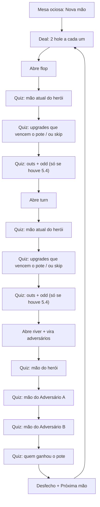

# PRD — Poker Trainer

> Fonte da verdade **funcional**. Descreve comportamento esperado, não arquitetura.
> Última atualização: 2026-09-13 (CR-002 — §5.4 desconto de outs + §5.8)
> Contexto: [context.md](context.md)

## 1. Visão do produto

O Poker Trainer é um simulador de **uma mesa de Texas Hold’em com três jogadores** cujo único jogo é a leitura — de categoria, de outs e da odd da próxima carta. Não se aposta. Não se paga blind. Não se folda. A cada rodada o software embaralha, distribui, vira flop, turn e river e interroga o usuário em múltipla escolha: o que ele já tem, quais categorias ainda **viram o pote** contra um vilão assumido (desconto de outs), quantas outs e quais ranks, qual a odd, o que cada um completou no showdown e quem leva o pote.

O usuário é um jogador amador que, na mesa presencial, congela na leitura. O produto existe para repetir esse instante — cartas no feltro, adversários sentados, comunitárias abrindo — até a identificação ficar automática. Por isso a interface **não pode parecer um quiz com baralho colado ao lado**: tem de parecer uma mesa de poker online, com o questionário integrado ao feltro, no mesmo lugar onde um client de poker colocaria ações ou o chat.

O motor avalia mãos com ranking completo (incluindo kickers e empates) para decidir o pote com justiça e para comparar o herói ao vilão assumido. O quiz de categoria pede só o **rótulo** RN-014. Melhorar *dentro* da mesma categoria (par de 2 para par de Ás) **não** vira chip na §5.4 — essas cartas só entram na pergunta de outs. Pot Odds não entra neste PRD.

**Não há fase preflop de perguntas.** Depois do deal das hole cards, a mesa abre o flop e só então o HUD pergunta. No river, a mão do herói é perguntada **uma vez**, já no showdown (não se repete a pergunta da seção 5.3).

## 2. Objetivos e métricas

| Objetivo | Métrica | Meta |
|----------|---------|------|
| Acelerar identificação da mão feita | Acurácia na 1ª tentativa por categoria | Tendência de alta com o volume de mãos |
| Acelerar leitura de upgrades que vencem o pote | Acurácia na 1ª tentativa por categoria na pergunta da §5.4 (desconto de outs) | Tendência de alta |
| Acelerar contagem de outs e odd | Acurácia na 1ª tentativa em `outs` (quantidade e ranks) e em `odds` | Tendência de alta |
| Acelerar leitura de showdown | Acurácia na 1ª tentativa nas mãos dos três jogadores e no vencedor | Tendência de alta |
| Manter imersão | A sessão inteira ocorre sobre a mesa, sem telas que “saiam do clube” | Fluxo flop → river sem quebrar o layout da mesa |

## 3. Escopo

### 3.1 Incluído

- Mesa visual de Texas Hold’em com herói + 2 adversários.
- Embaralhamento de alta entropia e deal animado.
- Quiz no flop, no turn e no river/showdown; categorias e odd em até 6 opções (sempre tentando 6); ranks de outs em 13 chips.
- Retry até acertar, com opção errada desabilitada.
- Persistência da evolução por categoria (1ª tentativa), sem tela de relatório.
- Resultado da rodada + **Próxima mão**.
- Empate / pote dividido.
- Som suave, avatares, fichas decorativas, animações de carta.
- Colinha de classificação das 10 categorias no desktop (PRD §5.7).

### 3.2 Excluído

- Qualquer ação de aposta (blinds, raise, fold, side pot) e **Pot Odds** (preço do pote vs odd).
- Quiz **preflop** (antes do flop abrir).
- Draws nomeados como rótulo de opção (gutshot, flush draw, overcards).
- Enunciado com kickers ou “par de ases” no quiz de **categoria**.
- Chip de upgrade *dentro* da mesma categoria (par mais forte, flush mais alto) — o detalhe vai para a §5.8 (outs).
- Regra do 4 (flop→river / all-in).
- Relatório/gráficos de evolução; botão de zerar estatísticas (limpar dados do site no navegador basta). A colinha da §5.7 **não** é relatório nem ranking de desempenho.
- Controle de mute/volume na UI (se o browser bloquear o áudio, a mesa segue muda).
- Desistir da mão em curso (só completar ou recarregar a página).
- Conta, nuvem, multiplayer, outras variantes de poker.
- Colinha no celular; persistir se a colinha está oculta; usar a colinha como cola na mesa ao vivo.
- Destacar na colinha a mão atual da mesa ou clicar nela para responder o quiz.

## 4. Personas e permissões

| Persona | Permissões / Ações permitidas |
|---------|------------------------------|
| Treinando (único papel) | Iniciar rodada, responder quizzes, pedir próxima mão, ouvir/ver a mesa, ocultar e reabrir a colinha no desktop. Não há login. Os dados de evolução pertencem a este navegador. |

## 5. Funcionalidades

> **Seção obrigatória.** Fonte do `speckit-roadmap.md`.

### Fluxo canônico de uma mão

```mermaid
flowchart TD
  idle[Mesa ociosa: Nova mão]
  deal[Deal: 2 hole a cada um]
  flopOpen[Abre flop]
  qHeroFlop["Quiz: mão atual do herói"]
  qUpFlop["Quiz: upgrades que vencem o pote / ou skip"]
  qOutsFlop["Quiz: outs + odd (só se houve 5.4)"]
  turnOpen[Abre turn]
  qHeroTurn["Quiz: mão atual do herói"]
  qUpTurn["Quiz: upgrades que vencem o pote / ou skip"]
  qOutsTurn["Quiz: outs + odd (só se houve 5.4)"]
  riverOpen[Abre river + vira adversários]
  qHeroRiver["Quiz: mão do herói"]
  qA["Quiz: mão do Adversário A"]
  qB["Quiz: mão do Adversário B"]
  qWin["Quiz: quem ganhou o pote"]
  result[Desfecho + Próxima mão]
  idle --> deal --> flopOpen --> qHeroFlop --> qUpFlop --> qOutsFlop --> turnOpen --> qHeroTurn --> qUpTurn --> qOutsTurn --> riverOpen --> qHeroRiver --> qA --> qB --> qWin --> result --> deal
```

Cada caixa de quiz só avança depois de acerto (com retry). Não existe pergunta entre o deal e o flop. Se a lista da §5.4 for vazia, o fluxo do flop/turn vai ao skip (`sem_upgrade`) e **não** passa pelas perguntas de outs/odd.

---

### 5.1 Mesa imersiva e sessão de treino

**Objetivo:** Fazer o treino acontecer *dentro* de uma mesa de poker online, não ao lado dela. Esta funcionalidade define o casco visual e o ciclo de uma sessão.

**Diretriz de UX (obrigatória):** a tela principal é uma **mesa**. Feltro oval, rail, posições, cartas, avatares e um pote de fichas decorativo. Perguntas, feedback e o botão **Próxima mão** entram como **HUD da própria mesa** (faixa inferior / painel sobre o feltro), no estilo da barra de ações de um client de poker — nunca como `alert()`, nunca como formulário branco de site institucional, nunca como cartões de “questionário escolar” flutuando soltos sobre um fundo genérico.

**Estados do HUD (obrigatório):**

| Estado | Quando | O que o HUD mostra |
|--------|--------|---------------------|
| `ociosa` | App aberto, após reload no meio da mão, ou após o usuário ainda não ter iniciado | Uma linha de propósito + CTA **Nova mão** |
| `deal` | Cartas voando | Sem opções clicáveis (não dispara quiz em cima do deal) |
| `perguntando` | Street aberta, quiz ativo | Enunciado + opções (até 6 nas categorias/odd/quantidade; 13 ranks na §5.8) |
| `sem_upgrade` | Lista da §5.4 vazia no flop/turn (RN-060) | Frase de que não há mão que vire o pote + **Continuar** |
| `resultado` | Vencedor acertado | Quem levou o pote, as 3 categorias já identificadas, **Próxima mão** |

**Fluxo principal:**
1. O usuário abre o app e vê a mesa ociosa: três assentos ocupados, slots de comunitárias vazios, pote decorativo, CTA **Nova mão**.
2. Ao iniciar, o deal das hole cards acontece na mesa (ver 5.2). **Ainda não há pergunta.**
3. Em seguida abre o flop; só então o HUD entra em `perguntando` com o quiz do flop (5.3 → 5.4 → 5.8 se a 5.4 não for skip).
4. Após o flop completo, abre o turn e o quiz do turn (5.3 → 5.4 → 5.8 se a 5.4 não for skip).
5. Após o turn completo, abre o river, as hole cards dos adversários viram no lugar (showdown) e o HUD segue a sequência 5.5.
6. Ao acertar quem ganhou, o HUD vai a `resultado` e o botão **Próxima mão** inicia um novo deal na mesma mesa, sem reload perceptível da página.

**Fluxos alternativos:**
- Primeira visita e toda mesa `ociosa`: uma linha (“Treine ler as mãos. Sem apostas.”). Não há wizard.
- Recarregar no meio da mão: a mão em curso perde-se; a evolução persistida permanece; HUD volta a `ociosa`.

**Fluxos de exceção:**
- Áudio bloqueado: mesa muda; treino segue; sem modal agressivo.
- Animações pesadas: cartas ainda devem chegar aos lugares certos; o quiz só habilita **depois** de pousarem (ver ritmo abaixo).

**Regras de negócio:**
- RN-001: Variante fixa: Texas Hold’em. Cada jogador recebe **2 hole cards** (privadas; fechadas para os outros). O board tem **5 comunitárias** (flop 3, turn 1, river 1). “Fechadas” em RN-001 refere-se ao padrão Hold’em, não a esconder as cartas do herói de si mesmo (ver RN-006).
- RN-002: Sempre **3 jogadores**: Herói (usuário, assento inferior, frente à câmera), Adversário A e Adversário B. Sem assentos vazios no MVP.
- RN-003: Não há apostas, blinds, dealer button funcional, timer de ação nem fold. Fichas e pote são **cenografia** (sem valor em bb). No split, o bolo de fichas divide-se visualmente — não há contas.
- RN-004: Idioma da UI: português. Termos de clube (flop, turn, river, showdown) podem permanecer em inglês, com rótulo claro. Os **10 nomes de categoria do quiz** são os de RN-014, sem sinônimos na UI (não misturar “Sequência” e “Straight”).
- RN-005: Cartas dos adversários permanecem **fechadas** até o início do showdown (river aberto + virada).
- RN-006: O herói vê as próprias hole cards desde o fim do deal (abertas no assento inferior).
- RN-007: Desktop é o layout de referência. Tablet: mesa + HUD sem cortar cartas. Celular no MVP: HUD pode empilhar abaixo; cartas ainda legíveis; imersão não precisa igualar o desktop.
- RN-041: **Não há quiz preflop.** Nenhuma pergunta ocorre com o board ainda vazio.
- RN-042: Não há CTA “Desistir” / “Nova mão” durante uma mão em curso. Abandonar = recarregar a página.
- RN-043: Labels de CTA: mesa ociosa = **Nova mão**; após o desfecho = **Próxima mão**. Não usar “Embaralhar” como nome de botão.

**Casos de erro:**

| Situação | Comportamento esperado |
|----------|------------------------|
| Áudio bloqueado pelo navegador | Mesa muda; treino segue; sem modal de erro agressivo |
| Tela estreita demais | HUD desce; cartas da mesa não devem sobrepor-se até ficarem ilegíveis |
| Recarregar no meio da mão | Volta à mesa ociosa; evolução já persistida não some |

**Critérios de aceitação:**
- [ ] CA-001: Dado o app aberto no desktop em estado ocioso, quando o usuário vê a tela, então há feltro, três assentos com avatar/nome, slots de comunitárias e CTA **Nova mão** — sem opções de quiz ainda.
- [ ] CA-002: Dado o flop acabou de pousar, quando o HUD pergunta, então as três cartas estão no centro, as opções estão habilitadas, e o enunciado é o da mão atual do herói.
- [ ] CA-003: Dado o flop/turn, quando se olha os assentos adversários, então as hole cards deles estão viradas para baixo.
- [ ] CA-004: Dado o início do showdown, quando a primeira pergunta do river aparece, então as hole cards dos dois adversários estão abertas nos respectivos assentos.
- [ ] CA-005: Dado o fim da rodada, quando o usuário aciona **Próxima mão**, então a mesa permanece, as cartas são recolhidas e uma nova mão é distribuída (de novo sem quiz preflop).
- [ ] CA-026: Dado o deal em andamento, quando as hole cards ainda voam, então o HUD **não** apresenta opções clicáveis.

**UI/UX desta funcionalidade (detalhe de produto):**

- **Feltro:** verde-mesa profundo (não “verde lima de clipart”), rail em madeira ou borracha escura, vinco oval, iluminação que simula holofote no centro (comunitárias no ponto mais claro). A mesa deve parecer clube, não planilha.
- **Cartas:** baralho clássico de poker, índices grandes e contrastados, naipes vermelho/preto inequívocos, verso padronizado (único verso para cartas fechadas). Tamanho suficiente para ler rank e naipe a ~70 cm do monitor. Nunca usar emojis nem caracteres Unicode de baralho (U+1F0A0…) como carta principal.
- **Assentos:** cada jogador tem avatar (ilustração ou ficha de personagem, não foto de pessoa real), apelido estável (**Você**, **Adversário A**, **Adversário B**) e um pequeno stack de fichas decorativo. O herói é visualmente “o lugar do player” (maior, mais perto, HUD ancorado nele).
- **Board:** as cinco comunitárias têm slots fixos no centro (três do flop já alinhados; turn e river entram nos slots 4 e 5). Slots vazios visíveis antes da street, como em clients de poker.
- **HUD:** tipografia de UI nítida sobre fundo escuro/translúcido, alto contraste, uma pergunta por vez, opções em botões grandes clicáveis. Estado: padrão, hover, foco teclado, selecionado, correto, errado-desabilitado. Feedback de acerto/erro é uma reação da mesa (flash no HUD, som curto, texto “Você acertou” / “Não é essa. Tente de novo.”) — não um popup do browser.
- **Movimento:** deal em leque/deslize até o assento; flop abre as três em sequência rápida; turn e river podem “queimar” visualmente (verso teatral, depois a street abre) de forma breve. O quiz só habilita depois das cartas da street pousarem. Teto: ~1 s de animação por street depois da primeira mão da sessão (a primeira pode ser um pouco mais lenta). “Não travar a UI” ≠ “permitir clique enquanto a carta ainda voa”.
- **Som (MVP):** mix baixo; se o browser bloquear, segue mudo. Eventos: shuffle, deal, flop, virada de showdown, acerto, erro. Sem trilha contínua. Sem botão de mute no MVP.
- **O que não fazer:** fundo branco de landing page; logo gigante; cards Material estilo dashboard; lista HTML nua; baralho de Unicode; confetes infantis; mascote falante; tutorial de 8 passos.
- **Canto superior direito (desktop):** a §5.7 MAY ocupar este canto com a colinha em overlay. Comunitárias, hole cards, assentos e HUD permanecem desobstruídos (RN-050).

---

### 5.2 Embaralhamento e distribuição das cartas

**Objetivo:** Cada rodada deve ser uma mão **nova e imprevisível**, como um dealer humano honesto com baralho completo, antes de qualquer pergunta.

**Fluxo principal:**
1. O usuário inicia a mão (**Nova mão** ou **Próxima mão**).
2. O sistema mistura entropia do cliente (cursor, data/hora, tick e demais fontes) e permuta um baralho padrão de 52 cartas.
3. Atribui cartas pela RN-044 e anima o deal: hole cards primeiro (adversários fechadas, herói abertas ao pousar).
4. Só depois abre o flop (três face-up) e entrega o controle ao quiz 5.3.

**Ordem temporal na mesa:**
1. Deal das hole cards.
2. Abre o flop → quiz do flop (5.3 + 5.4).
3. Abre o turn → quiz do turn (5.3 + 5.4).
4. Abre o river, vira o showdown → quiz 5.5.

**Fluxos alternativos:**
- N/A — não há reembaralhar no meio da mão.

**Fluxos de exceção:**
- Sem movimento de mouse ainda: usa as outras fontes; não trava a UI.

**Regras de negócio:**
- RN-008: Baralho único de 52 cartas francesas (13 ranks × 4 naipes), sem coringa, sem repetir carta na mesma mão.
- RN-009: Hole cards dos três jogadores e as 5 comunitárias são **11 cartas distintas**.
- RN-010: O embaralhamento é **refeito a cada rodada** e incorpora **pelo menos**: posição/movimento do cursor, data e hora, e relógio de alta resolução (tick). O objetivo de produto é imprevisibilidade percebida e real, não `Math.random()` sozinho. Detalhe de implementação: ADR-004.
- RN-011: Depois do shuffle, flop, turn e river já estão determinados. Não se reembaralha entre streets.
- RN-012: Os adversários recebem cartas reais do baralho (não mãos pré-montadas). O showdown usa essas cartas.
- RN-044: Após a permutação, o mapeamento **de dados** (não necessariamente a ordem visual do leque) é:
  - cartas `[0],[1]` → Adversário A
  - `[2],[3]` → Adversário B
  - `[4],[5]` → Herói
  - `[6],[7],[8]` → flop
  - `[9]` → turn
  - `[10]` → river
  - `[11]…[51]` → restante, **não usado** nesta mão
- RN-045: Queima (burn) é **só cenografia** (RN-G007). **Não consome** carta extra do baralho de dados. A mão usa exatamente as 11 cartas da RN-044. Um verso teatral de burn, se existir, não é uma 12ª carta do conjunto da mão.

**Casos de erro:**

| Situação | Comportamento esperado |
|----------|------------------------|
| Entropia de mouse ainda vazia | Segue o shuffle com relógio e demais fontes; não trava a UI |
| Falha ao montar o baralho | Não inicia a mão; HUD volta a `ociosa` e pede **Nova mão** |

**Critérios de aceitação:**
- [ ] CA-006: Dado duas rodadas seguidas, quando se comparam as 11 cartas, então não são sistematicamente iguais.
- [ ] CA-007: Dado o deal, quando se listam as 11 cartas (6 hole + 5 board), então todas são distintas e pertencem ao baralho padrão; burns visuais, se houver, não criam 12ª carta de jogo.
- [ ] CA-008: Dado o deal das hole cards recém-concluído, quando o flop ainda não abriu, então os três slots do flop **não** estão face-up e não há quiz.
- [ ] CA-009: Dado o quiz do flop concluído, quando começa o turn, então exatamente a carta `[9]` abre no slot 4, sem alterar o flop.

---

### 5.3 Identificação da mão atual (flop e turn)

**Objetivo:** Treinar o reconhecimento da **melhor categoria já completa** do herói na street, com as cartas que ele vê.

**Onde ocorre:** somente **flop** e **turn**, depois da street pousar. No river, o **mesmo contrato** (categoria, 6 opções, clique submete, retry, 1ª tentativa) é usado na primeira pergunta do §5.5 — **não** há uma pergunta extra de 5.3 no river.

**Fluxo principal:**
1. O HUD pergunta: **“Qual mão você tem agora?”**
2. Exibe **exatamente 6** opções de categoria (RN-014), seleção única, ordem visual embaralhada (RN-G008).
3. O clique numa opção **submete** na hora (sem botão Confirmar).
4. Acerto: “Você acertou”; beat curto; avança para 5.4 na mesma street.
5. Erro: “Não é essa. Tente de novo.”; a opção clicado desabilita e permanece visível; nova escolha até acertar.
6. A **primeira** escolha alimenta `mao_atual` da categoria **correta** (acerto ou erro). Tentativas seguintes não alteram contadores.

**Fluxos alternativos / exceção:**
- Sempre existe exatamente uma melhor categoria (RN-013). Não há skip.

**Regras de negócio:**
- RN-013: A mão atual é a **melhor 5 cartas** possível com as cartas **já visíveis ao herói**:
  - Flop: 2 hole + 3 flop = exatamente 5 cartas (uma combinação).
  - Turn: 2+4 = 6 cartas → melhor combinação de 5 entre as 6.
  - (No river, o mesmo critério com 2+5, aplicado no §5.5.)
  No turn/river a melhor 5 pode usar 0, 1 ou 2 hole cards (jogar a mesa é legal).
- RN-014: Categorias oficiais, **rótulo exato na UI**, da mais forte para a mais fraca:

  | # | Rótulo na UI | Definição (5 cartas) |
  |---|--------------|----------------------|
  | 1 | Royal flush | A, K, Q, J, 10 **do mesmo naipe** |
  | 2 | Straight flush | 5 consecutivas do mesmo naipe, que **não** sejam royal |
  | 3 | Quadra | Quatro cartas do mesmo rank + 1 kicker |
  | 4 | Full house | Trinca + um par |
  | 5 | Flush | 5 do mesmo naipe, não consecutivas o bastante para SF/royal |
  | 6 | Straight | 5 ranks consecutivos, naipes mistos. **Ás-alto** (10-J-Q-K-A) ou **wheel** (A-2-3-4-5, Ás baixo). **Não existe** straight circular (K-A-2-3-4 é inválido) |
  | 7 | Trinca | Três do mesmo rank, sem par extra (senão seria full house) |
  | 8 | Dois pares | Dois pares distintos + 1 kicker |
  | 9 | Par | Um par + 3 kickers |
  | 10 | Carta alta | Nenhuma das anteriores |

- RN-015: Se a mão é royal, a correta é **Royal flush**, nunca Straight flush. Se é A-2-3-4-5 suited, é **Straight flush**, nunca Royal.
- RN-016: Enunciado e opções **não** incluem kicker, naipe por extenso nem rank (“par de reis”). Só o rótulo RN-014.
- RN-017: Sempre **6 opções distintas**, a correta sempre inclusa. Distratoras: (1) categorias vizinhas na tabela RN-014; (2) categorias que o *board* torna visualmente tentadoras (dois+ do mesmo naipe → Flush; board conectado → Straight; board pareado → Trinca/Dois pares/Full house); (3) se ainda faltar, preenche de cima para baixo na RN-014, sem repetir. Nunca menos de 6 nesta pergunta (há 10 categorias).
- RN-018: Complementa RN-017: o universo tem 10 categorias; 1 correta + 5 distratoras.
- RN-019: Estatística: só a **primeira tentativa**, na categoria **correta** (`mao_atual`). Chutar “Flush” quando a certa é Par registra erro em **Par**, não em Flush.
- RN-046: Força *dentro* da categoria (par de 2 vs par de Ás, flush ao 9 vs flush ao Ás) **não** muda a resposta do quiz.

**Casos de erro:**

| Situação | Comportamento esperado |
|----------|------------------------|
| Clique em opção já desabilitada | Ignora |
| Clique fora das opções | Não avança |

**Critérios de aceitação:**
- [ ] CA-010: Dado o flop aberto, quando o herói tem um par como melhor mão, então a única opção correta é **Par**, e acertá-la de primeira registra acerto em Par (`mao_atual`).
- [ ] CA-011: Dado um erro na primeira opção, quando o usuário clica de novo, então a opção errada está desabilitada, pediu-se nova tentativa, e `mao_atual` da categoria correta já tem +1 erro.
- [ ] CA-012: Dado um acerto no flop, quando o feedback termina o beat, então segue a pergunta da §5.4 (upgrades que vencem o pote) ou o skip de “sem upgrade” — não o turn ainda e não a §5.8 antes da 5.4.
- [ ] CA-013: Dado o quiz de categoria (flop, turn, ou qualquer uma das três mãos do §5.5), quando as opções aparecem, então há exatamente 6 rótulos distintos de RN-014, incluindo o correto, em ordem visual não constante.

---

### 5.4 Identificação de mãos que ainda vencem o pote (flop e turn)

**Objetivo:** Treinar **upgrades de categoria que viram o pote**: o que o herói ainda não tem, mas ainda pode ter como melhor mão na **próxima carta**, de modo a ficar **estritamente superior** ao vilão assumido (desconto de outs). Fonte pedagógica: [docs/studies/outs-and-odds.md](studies/outs-and-odds.md).

**Não ocorre no river** (não resta carta).

**RN-020 e CA-014–CA-017** (versão “ainda possível” sem vilão) estão **substituídos** por RN-055+ e CA-033+ (CR-002). Os códigos antigos não se reutilizam.

**Fluxo principal:**
1. Só depois da 5.3 da mesma street estar acertada.
2. O motor monta o vilão assumido (RN-055) e a lista de upgrades vencedores (RN-057) olhando **só a próxima carta**.
3. Se a lista for vazia (já à frente ou drawing dead): HUD `sem_upgrade`, frase **“Não há mão que vire o pote.”**, **Continuar** — sem estatística `upgrade`, **sem** §5.8 — e avança street (RN-060).
4. Senão pergunta: **“Quais mãos melhoram o seu jogo com chance de ganhar o pote?”** + a linha de suposição (RN-059).
5. Até 6 opções (RN-023), múltipla seleção, ordem embaralhada (RN-G008). O usuário marca e aperta **Confirmar**.
6. Avaliação RN-024/025 até o conjunto das opções **exibidas** estar correto.
7. Feedback de acerto do conjunto e segue a **§5.8** da mesma street (não o turn/river ainda).

**Regras de negócio:**
- RN-055: Vilão assumido — **duas cartas concretas**, legais (não repetem hole do herói nem o board), escolhidas por receita pessimista. As hole reais de A e B **não** entram. O HUD declara a suposição; A e B permanecem fechados. Texturas aplicáveis (pode haver mais de uma):
  - Board com **3 ou mais** cartas do mesmo naipe → assume **Flush** feito (dois mais altos daquele naipe ainda livres).
  - Board com **4 ranks únicos em sequência** (consecutivos, wheel A-2-3-4 permitido, wrap K-A-2-3 proibido) → assume **Straight** feito (as duas cartas que completam a sequência **mais alta** possível; se só uma carta completa, a segunda é o melhor kicker livre).
  - Board **pareado** → assume **Trinca** do par mais alto da mesa (uma carta desse rank + melhor kicker livre). Dois pares na mesa: usa o par de rank maior.
  - Caso contrário → assume o **par mais alto da mesa** (uma carta do maior rank do board + melhor kicker livre, Ás se couber).
  Se duas ou mais texturas se aplicam, fica a suposição cuja melhor 5 **atual** (2 assumidas + board, sem a próxima carta) for a **mais forte** no ranking completo (RN-029). Se uma textura não puder ser montada com 2 cartas livres, descarta-a e tenta a seguinte nessa ordem de força. Descer o rank do “par mais alto” (2º do board, etc.) só se o herói tiver esgotado as cartas do rank alvo.
- RN-059: A linha de suposição é uma frase só, sem listar as 2 cartas, sem kicker por extenso, sem revelar A/B. Texto conforme a categoria da mão assumida **já feita** no board atual:
  - Par → **“Suponha que o adversário já tem o par mais alto da mesa.”**
  - Trinca → **“Suponha que o adversário já tem trinca do par da mesa.”**
  - Straight → **“Suponha que o adversário já tem Straight.”**
  - Flush → **“Suponha que o adversário já tem Flush.”**
  - Outra categoria RN-014 (Full house, Quadra, etc., se o board empurrar a mão assumida) → **“Suponha que o adversário já tem {rótulo}.”**
- RN-056: Baralho da próxima carta = 52 − 2 hole do herói − comunitárias já abertas − 2 assumidas. Flop: cada uma das restantes como **turn**. Turn: cada uma como **river**. Runner-runner **não** conta. Hole reais de A/B que não coincidam com as assumidas **permanecem** no baralho da próxima carta.
- RN-069: Horizonte único da §5.4 e da §5.8 = **a próxima carta**.
- RN-060: Lista vazia de upgrades vencedores (herói já à frente do assumido, ou nenhuma próxima carta vence) → HUD `sem_upgrade` com **“Não há mão que vire o pote.”** + **Continuar**. MUST NOT abrir a §5.8. MUST NOT alterar `upgrade`, `outs` nem `odds`.
- RN-057: A categoria C é upgrade vencedor se e somente se existe **pelo menos uma** carta do baralho da próxima carta tal que, após ela abrir: (1) a melhor 5 do herói tem categoria **exatamente C**; (2) C é **estritamente mais forte** que a mão atual (RN-014); (3) a melhor 5 do herói **vence estritamente** a melhor 5 do vilão assumido (2 assumidas + board + essa carta). Empate com o vilão **não** torna C verdadeira (RN-070).
- RN-070: Só mão **estritamente superior** conta. Split no desfecho hipotético não é out nem upgrade vencedor.
- RN-021: Categoria igual ou mais fraca que a atual **não** é upgrade (quem tem trinca não “ainda forma um par”).
- RN-022: **Carta alta** nunca é upgrade.
- RN-046 (reitera): ir de “par fraco” para “par forte” **não** é chip nesta pergunta. Se o herói já tem Par e um Rei faria um par melhor que o do vilão, **Par** não entra como verdadeira; essas cartas só aparecem na §5.8.
- RN-023: Montagem das opções (universo = upgrades **vencedores** desta street):
  - 1 a 5: mostra **todos** + distratoras (categorias que **não** são upgrade vencedor nesta street) até 6.
  - 6 ou mais: mostra **só os 6 mais fortes** (ordem RN-014), **sem distratoras**.
  - Os que **não couberam** nos 6 **não são cobrados e não geram estatística**.
- RN-024: Na **primeira Confirmação**, cada opção **exibida** é avaliada assim (bucket `upgrade`):

  | Situação na 1ª confirmação | Contador |
  |----------------------------|----------|
  | Upgrade verdadeiro **marcado** | +1 acerto nessa categoria |
  | Upgrade verdadeiro **não marcado** | +1 erro nessa categoria |
  | Distratora **marcada** (falso positivo) | +1 erro nessa categoria |
  | Distratora **não marcada** | não incrementa (nem acerto) |

- RN-025: Depois da 1ª confirmação: distratoras marcadas desabilitam; upgrades já marcados corretamente travam (não desmarcar); upgrades verdadeiros ainda não marcados continuam selecionáveis. Nova **Confirmar** até o conjunto exibido estar perfeito. Não altera contadores da 1ª vez (RN-026).
- RN-026: Tentativas seguintes não mudam `upgrade`.
- RN-027: Sem vocabulário de draws **como rótulo de opção** (`flush draw`, `gutshot`, `overcards`). Os termos de clube **outs** e **odd** aparecem só na §5.8. Sempre tentar 6 opções nesta pergunta, salvo o skip de lista vazia.
- RN-071: As 2 cartas assumidas, o baralho da próxima carta, a lista de outs e o dump de comparação **nunca** vão para `localStorage` / `sessionStorage` / cookie / IndexedDB, nem viram hole cards visíveis de A ou B.

**Casos de erro:**

| Situação | Comportamento esperado |
|----------|------------------------|
| Confirmar sem marcar nada quando há upgrade vencedor nas opções | Erro na 1ª vez em cada upgrade omitido; pede de novo |
| Marcar todas havendo distratora | Distratora desabilita; pede correção |
| Falha ao montar o vilão assumido | A mão aborta: HUD `ociosa` + **Nova mão**; MUST NOT fingir lista vazia; contadores já gravados nesta visita permanecem |

**Critérios de aceitação:**
- [ ] CA-033: Dado herói **K♣ Q♦**, board **10♠ 9♦ 5♣** (flop) e vilão assumido = par mais alto (um 10 + melhor kicker legal), quando a 5.4 abre, então o enunciado é **“Quais mãos melhoram o seu jogo com chance de ganhar o pote?”**, a linha é **“Suponha que o adversário já tem o par mais alto da mesa.”**, **Par** e **Straight** são verdadeiros (Rei/Dama fazem par maior; Valete faz sequência), e um par de 9 ou de 5 **sozinho** não torna **Par** falso — **Par** continua verdadeiro por causa de Rei/Dama.
- [ ] CA-034: Dado que a única forma de completar **Par** na próxima carta perde do vilão assumido (par menor ou carta que também dá jogo melhor a ele), quando a 5.4 abre, então **Par** **não** é upgrade verdadeiro.
- [ ] CA-035: Dado exatamente 2 upgrades vencedores no turn, quando o quiz abre, então esses 2 estão nas opções e há 4 distratoras (total 6).
- [ ] CA-036: Dado lista vazia de upgrades vencedores (herói já à frente do assumido, ou nenhuma próxima carta vence), quando seria a 5.4, então HUD `sem_upgrade` com **“Não há mão que vire o pote.”** + **Continuar**; `upgrade`, `outs` e `odds` não mudam; **não** há §5.8.
- [ ] CA-037: Dado Flush verdadeiro (vencedor) e Par distratora na 1ª confirmação, quando o usuário marca os dois, então Flush recebe acerto, Par recebe erro de falso positivo, Par desabilita, e a pergunta não fecha até o conjunto estar correto.
- [ ] CA-038: Dado a 5.4 aberta, quando se olham os assentos, então A e B continuam fechados e as 2 cartas assumidas **não** aparecem como hole cards.
- [ ] CA-039: Dado um flop em que Flush só existe runner-runner, quando a 5.4 abre, então **Flush** **não** é verdadeiro.

> CA-014–CA-017 (lista “ainda possível” sem vilão) foram **substituídos** por CA-033–CA-039.

---

### 5.5 Showdown: mãos dos adversários e vencedor do pote

**Objetivo:** Treinar a leitura das três mãos abertas e quem leva o pote — inclusive empate.

**Fluxo principal:**
1. Após o quiz do turn (5.3 → 5.4 → 5.8 ou skip), a carta `[10]` abre no slot 5.
2. Hole cards de A e B viram nos assentos.
3. O HUD pergunta **nesta ordem**, cada uma só depois da anterior acertada:
   1. Qual mão **você** completou? — contrato 5.3 (é a única identificação da mão do herói no river)
   2. Qual mão o **Adversário A** completou? — contrato 5.3, categoria da melhor 5 de A
   3. Qual mão o **Adversário B** completou? — idem para B
   4. **Quem ganhou o pote?** — seleção única, clique submete, até 6 opções (RN-030/031), retry, 1ª tentativa em `vencedor_pote`
4. Acerto do vencedor → HUD `resultado` (destaque no(s) vencedor(es), fichas caminham, as três categorias já acertadas podem ser reiteradas) + **Próxima mão**.

**Fluxos alternativos:**
- Split de dois ou dos três: o resultado celebra empate, não um único champion.

**Regras de negócio:**
- RN-028: A categoria de cada jogador é a melhor 5 usando as **2 hole daquele jogador + as 5 comunitárias**. Pode usar 0, 1 ou 2 hole cards. Board que “joga para todos” (ex.: royal na mesa) implica a **mesma categoria** para os três.
- RN-029: O vencedor usa ranking completo de Texas Hold’em nas **5 cartas da melhor mão**, com desempate padrão:
  - mesma categoria → compara os ranks que definem a mão (quadra: quadra depois kicker; full house: trinca depois par; flush: os cinco ranks do mais alto ao mais baixo; straight: topo da sequência, wheel vale 5; dois pares: par maior, par menor, kicker; par: par depois três kickers; carta alta: cinco ranks);
  - as 5 cartas iguais → **empate** (pote dividido entre os empatados).
  Kickers **nunca** aparecem no texto das opções (RN-G004).
- RN-030: Universo de enunciados de “quem ganhou” (sempre estes textos):
  - Você
  - Adversário A
  - Adversário B
  - Você e Adversário A
  - Você e Adversário B
  - Adversário A e Adversário B
  - Os três empatam
- RN-031: A correta entra sempre. Completar até 6 nesta ordem de prioridade, **sem repetir**, pulando a que já é a correta se ela já está inclusa: (1) Você (2) Adversário A (3) Adversário B (4) Você e Adversário A (5) Você e Adversário B (6) Adversário A e Adversário B (7) Os três empatam. Se a correta for “Os três empatam”, ela entra no passo inicial e as outras 5 seguem a mesma lista. Ordem **visual** embaralhada (RN-G008).
- RN-032: 1ª tentativa → `vencedor_pote` (acerto ou erro). Não há 10 categorias neste contador: é um único par acerto/erro/exposições.
- RN-033: No showdown, 2+5 de cada um estão visíveis; o usuário não precisa lembrar cartas já viradas.
- RN-038: Cada uma das três perguntas de categoria no river incrementa `mao_atual` da categoria **correta daquele jogador** (três exposições independentes).

**Casos de erro:**

| Situação | Comportamento esperado |
|----------|------------------------|
| Tentar o vencedor antes das três categorias | O HUD simplesmente ainda não mostra “quem ganhou” |

**Critérios de aceitação:**
- [ ] CA-018: Dado o river, quando a 1ª pergunta do showdown aparece, então as 6 hole cards e as 5 comunitárias estão face-up nos lugares certos.
- [ ] CA-019: Dado Adversário A com flush e herói com par, quando a pergunta da mão de A aparece, então a correta é **Flush**, com 6 opções e retry até acertar.
- [ ] CA-020: Dado empate verdadeiro herói vs A (mesmas 5 cartas efetivas), quando “quem ganhou” aparece, então a correta é **Você e Adversário A**, e as fichas se dividem visualmente entre os dois.
- [ ] CA-021: Dado um único vencedor acertado, quando o HUD vai a `resultado`, então indica quem levou e habilita **Próxima mão**.
- [ ] CA-027: Dado o river, quando se conta as perguntas de categoria do herói nesta street, então há **exatamente uma** (a primeira do §5.5), não duas.

---

### 5.6 Feedback de resposta e persistência da evolução

**Objetivo:** Fechar o ciclo de aprendizagem na hora e guardar, no dispositivo, a facilidade por categoria — para um relatório **futuro**, sem mostrá-lo no MVP.

**Fluxo principal:**
1. Contrato visual: escolha → feedback imediato → se erro, nova chance com a opção morta.
2. Na 1ª tentativa (clique em seleção única; 1ª **Confirmar** no multi-select) atualizam-se os contadores.
3. Dados sobrevivem a fechar a aba no mesmo navegador/origem.
4. Sem tela de relatório, gráfico, ranking ou botão “zerar” no MVP.

**Fluxos alternativos:**
- Limpar dados do site: evolução zera; mesa segue.

**Fluxos de exceção:**
- Armazenamento indisponível: treino continua; sem jargão técnico; evolução pode perder-se ao fechar.

**Regras de negócio:**
- RN-034: Acerto explícito (“Você acertou”).
- RN-035: Erro explícito, **sem revelar a certa**, convite a tentar de novo (“Não é essa. Tente de novo.”). A certa só aparece quando o usuário a escolhe (ou, no multi-select, quando o conjunto exibido fica correto). O HUD `resultado` pode reiterar o que ele já acertou.
- RN-036: Opção errada visível, estado eliminada, não clicável de novo naquela pergunta.
- RN-037: Contadores:
  - `mao_atual`: por cada rótulo RN-014 — acertos 1ª, erros 1ª, exposições
  - `upgrade`: idem
  - `vencedor_pote`: um único grupo acertos/erros/exposições
  - `outs`: um único grupo acertos/erros/exposições (quantidade **e** ranks da §5.8 são duas exposições independentes neste grupo)
  - `odds`: um único grupo acertos/erros/exposições
  No MVP, **exposições = acertos + erros** daquele bucket/categoria (não se conta “viu como distratora e não marcou”).
- RN-039: Não persistir nome, e-mail, apelido digitado nem identificador pessoal.
- RN-040: O modelo basta para um relatório futuro de taxa na 1ª tentativa. Sem replay de cartas no MVP.
- RN-047: Seleção única (5.3, “quem ganhou”, **quantas outs**, **qual odd**) submete **no clique**. Múltipla seleção (5.4 e **quais ranks são outs**) exige **Confirmar**.

**Casos de erro:**

| Situação | Comportamento esperado |
|----------|------------------------|
| Armazenamento recusado | Treino segue; evolução pode não sobreviver ao reload |
| Dados corrompidos | Descarta o bloco inválido e zera contadores, sem quebrar a mesa |

**Critérios de aceitação:**
- [ ] CA-022: Dado erro depois acerto na mesma pergunta de categoria, quando se lê a persistência, então a categoria correta tem +1 erro e +0 acerto naquela exposição.
- [ ] CA-023: Dado acerto de primeira em Flush como mão atual, quando fecha e reabre, então o acerto de Flush em `mao_atual` permanece.
- [ ] CA-024: Dado o MVP, quando se percorre a UI, então não há tela de relatório, gráfico, tabela de desempenho nem botão de zerar stats. A colinha da §5.7 não conta como relatório nem como ranking de desempenho.
- [ ] CA-025: Dado um acerto, quando o feedback aparece, então é no HUD (não `alert`) e distingue-se do erro por **texto e** estado visual.

---

### 5.7 Colinha de classificação de mãos

**Objetivo:** Quem ainda não decorou a hierarquia de Texas Hold’em consulta, no canto da mesa, uma miniatura das 10 categorias — qual mão ganha de qual — sem sair do clube, sem revelar a resposta do quiz e sem parecer uma prova escolar ao lado do feltro.

**Diretriz de UX:** overlay compacto no visual de clube (feltro/rail), não infográfico vermelho de site. Cartas-exemplo no mesmo idioma visual da mesa (baralho clássico, índices legíveis em miniatura). A mesa continua o herói; a colinha é chrome que se oculta.

**Fluxo principal:**
1. No desktop, ao abrir o app (qualquer estado do HUD), a colinha está **visível** no canto superior direito: título **Classificação de mãos**, sentido Melhor → Pior, e as 10 linhas de RN-014.
2. Cada linha tem número de ordem (1–10), rótulo canônico e cinco cartas-exemplo fixas; cartas que não formam o conjunto principal daquela categoria ficam esmaecidas.
3. O usuário só olha. Não usa a colinha para responder.
4. Aciona **Ocultar**; o painel some e resta um botão discreto **Colinha** no mesmo canto.
5. Aciona **Colinha**; o painel volta. O estado vale só nesta visita.

**Fluxos alternativos:**
- Viewport estreito (celular / layout compacto da mesa, largura ≤ 900 px CSS): a colinha **não existe** — nem o painel nem o botão.
- Mesa `ociosa`, `deal`, `perguntando`, `sem_upgrade` ou `resultado`: se o desktop mostra a colinha (ou o botão, se oculta), ela permanece no canto, fora do HUD.

**Fluxos de exceção:**
- N/A — componente estático. Sem dados da mão, sem rede, sem persistência própria. Falha de render da colinha **não** aborta a mão nem o quiz (fail-open: a mesa segue).

**Regras de negócio:**
- RN-048: A colinha lista **exatamente** as 10 categorias de RN-014, da mais forte para a mais fraca, com os **rótulos exatos**. MUST NOT usar sinônimos (`Sequência`, `Um par`, `Straight flush real`, etc.).
- RN-049: Cada linha mostra um **exemplo ilustrativo fixo** de cinco cartas no visual de baralho do produto (índices + naipes; sem emoji/Unicode de baralho). As cartas do exemplo **não** são as da mão em curso. Cartas que não entram no conjunto principal daquela categoria (kicker da quadra, kickers de par, cartas de carta alta que não são a mais alta, etc.) ficam **esmaecidas**. O exemplo de cada categoria é estável entre visitas (não embaralha a cada mão).
- RN-050: No layout largo da mesa (acima do breakpoint estreito da §5.1, típico ≤ 900 px), a colinha inicia **visível** no canto **superior direito**, em overlay. MUST NOT cobrir comunitárias, hole cards, assentos nem o HUD. No viewport de referência 1280×720 as cartas-exemplo e os rótulos permanecem legíveis.
- RN-051: O usuário pode ocultar e reabrir na **mesma visita**. Oculta → só o controle discreto **Colinha** no mesmo canto. MUST NOT gravar essa preferência em `localStorage`, `sessionStorage`, cookie ou outra persistência. Recarregar a página no desktop restaura a colinha **visível**.
- RN-052: A colinha é **estática** em relação ao treino: MUST NOT destacar a categoria da mesa, MUST NOT marcar a opção certa do quiz, MUST NOT submeter resposta. Clique ou tecla em uma linha da lista MUST NOT alterar o HUD. Continua valendo RN-G005 (nada na colinha revela a resposta).
- RN-053: Em viewport estreito (largura ≤ 900 px CSS, o mesmo recorte compacto da §5.1), MUST NOT existir colinha nem o botão **Colinha**.
- RN-054: A colinha não é pergunta, não entra no HUD, não incrementa evolução e não persiste cartas nem informação set. O título visível é **Classificação de mãos**. Controles em português (**Ocultar**, **Colinha**), alcançáveis por teclado. MUST NOT incorporar, copiar pixel a pixel nem carregar por URL a arte de terceiros usada só como referência de composição.

**Casos de erro:**

| Situação | Comportamento esperado |
|----------|------------------------|
| Falha ao montar o overlay | Mesa e quiz seguem; sem modal; colinha pode ausentar-se nesta visita |
| Recarregar com a colinha oculta | Desktop: colinha visível de novo; evolução persistida inalterada |

**Critérios de aceitação:**
- [ ] CA-028: Dado o app aberto no desktop 1280×720 em estado ocioso, quando o usuário vê a tela, então a colinha está visível no canto superior direito com as 10 linhas de RN-014 (rótulos exatos, ordem 1→10), cada uma com cinco cartas-exemplo, e não cobre comunitárias, assentos nem o HUD.
- [ ] CA-029: Dado a colinha visível no desktop, quando o usuário oculta e depois reabre, então o painel some deixando só **Colinha** no mesmo canto e, ao reabrir, o painel volta com as mesmas 10 linhas; ao recarregar a página, a colinha está visível de novo.
- [ ] CA-030: Dado um quiz ativo (`perguntando`), quando o usuário olha ou aciona a colinha, então nenhuma linha está destacada como “a certa”, e clicar uma linha não muda enunciado, opções nem contadores.
- [ ] CA-031: Dado viewport com largura ≤ 900 px, quando se abre o app, então não há painel de classificação nem botão **Colinha**.
- [ ] CA-032: Dado a colinha ocultada no desktop, quando se inspeciona o armazenamento da origem, então a única chave de produto continua `poker-trainer:evolucao` (buckets `mao_atual`, `upgrade`, `vencedor_pote`, e após a 008 também `outs` e `odds`); não existe chave de preferência da colinha.

**UI/UX desta funcionalidade (detalhe de produto):**
- Lista vertical compacta; indicador discreto de Melhor (topo) → Pior (base).
- Esmaecer extras como na composição de referência — só o conjunto que define a categoria fica em destaque.
- Painel no cromo do clube (escuro, tipo, contraste); não reproduzir o fundo vermelho da referência.
- O botão **Colinha** (estado oculto) é mínimo: não compete com **Nova mão** / **Próxima mão**.

---

### 5.8 Outs e odd da próxima carta (flop e turn)

**Objetivo:** Depois de acertar quais categorias ainda vencem o vilão assumido, treinar a **contagem de outs limpos** (quantas e quais ranks) e converter isso na **odd** da próxima carta (regra do 2). Não treina Pot Odds.

**Pré-requisito:** §5.4 da mesma street acertada. **Não ocorre** após skip (RN-060) nem no river.

**Fluxo principal:**
1. Só depois do beat de acerto da 5.4.
2. HUD pergunta **“Quantas outs você tem?”** — seleção única, clique submete, 6 totais (RN-063), retry, 1ª tentativa em `outs`.
3. Acerto → **“Quais ranks são outs?”** — os 13 ranks (RN-064), múltipla seleção + **Confirmar**, retry no contrato RN-025 (conjunto), 1ª **Confirmar** em `outs` (exposição independente da quantidade).
4. Acerto do conjunto → **“Qual é a sua odd?”** — seleção única, 6 razões X:1 (RN-066), 1ª tentativa em `odds`.
5. Acerto da odd → avança a street (turn ou river).

**Fluxos alternativos:**
- Skip da 5.4: esta seção **não** roda.

**Regras de negócio:**
- RN-068: A §5.8 só abre se a 5.4 da mesma street teve lista não vazia e o conjunto exibido foi acertado. MUST NOT abrir no skip nem no river.
- RN-061: Uma carta do baralho da próxima carta (RN-056) é **out** se e somente se, ao abri-la, a melhor 5 do herói **vence estritamente** a melhor 5 do vilão assumido (mesmo RN-070). Cartas que só melhoram o herói sem virar o pote, ou que também dão ao vilão um jogo ainda melhor, **não** são outs (desconto). Cada carta conta no máximo uma vez.
- RN-062: Um rank é out se existe **pelo menos uma** carta-out desse rank. Se 2 de 4 Valetes forem sujos, **Valete** continua verdadeiro e a quantidade correta é 2 (não 4).
- RN-074: Ranks que melhoram dentro da mesma categoria (par melhor quando o herói já tem par) **entram** aqui se a carta for out (RN-061), mesmo sem terem sido chip na 5.4.
- RN-063: Enunciado **“Quantas outs você tem?”**. Sempre **6** inteiros distintos no intervalo 1–47, incluindo o N correto (N ≥ 1 nesta seção). Distratoras: preferir N±1, N±2 e os totais comuns {4, 5, 8, 9, 12, 15}, sem repetir, preenchendo o que faltar com o inteiro mais próximo ainda livre. Ordem visual embaralhada (RN-G008). Seleção única, clique submete.
- RN-064: Enunciado **“Quais ranks são outs?”**. Sempre os **13** rótulos, nesta identidade (ordem visual embaralhada): **2**, **3**, **4**, **5**, **6**, **7**, **8**, **9**, **10**, **Valete**, **Dama**, **Rei**, **Ás**. Distratora = rank sem out limpo. Múltipla seleção + **Confirmar**. Sem teto de 6. Sem “marcar todas”. Foco inicial na primeira opção da ordem visual.
- RN-065: P(ganho) = min(2 × N, 100)% com N = número de outs (RN-061). Odd = (100 − 2N) : (2N), ou X = 50/N − 1. Exibir **X:1** com X inteiro: arredondar ao mais próximo; **0,5 arredonda para baixo**. Gabarito canônico (N → X:1):

  | N | Odd | N | Odd | N | Odd | N | Odd |
  |---|-----|---|-----|---|-----|---|-----|
  | 1 | 49:1 | 6 | 7:1 | 11 | 4:1 | 16 | 2:1 |
  | 2 | 24:1 | 7 | 6:1 | 12 | 3:1 | 17 | 2:1 |
  | 3 | 16:1 | 8 | 5:1 | 13 | 3:1 | 18 | 2:1 |
  | 4 | 11:1 | 9 | 5:1 | 14 | 3:1 | 19 | 2:1 |
  | 5 | 9:1 | 10 | 4:1 | 15 | 2:1 | 20 | 1:1 |

  N > 20: a mesma fórmula. Sempre regra do **2** (próxima carta), no flop e no turn. MUST NOT usar a regra do 4.
- RN-066: Enunciado **“Qual é a sua odd?”**. Sempre **6** razões distintas no formato **X:1**, incluindo a correta. Distratoras: X±1 e razões comuns {2:1, 3:1, 4:1, 5:1, 9:1, 11:1}, sem repetir. Ordem visual embaralhada. Seleção única, clique submete.
- RN-067: 1ª tentativa de **quantas** → +1 acerto ou erro em `outs` (um grupo). 1ª **Confirmar** de **quais ranks**: conjunto perfeito das 13 → +1 acerto em `outs`; senão +1 erro em `outs` (não há acerto por rank). 1ª tentativa da odd → +1 acerto ou erro em `odds`. Tentativas seguintes não mudam esses buckets. MUST NOT gravar N, a lista de ranks, a razão, cartas ou o vilão assumido.
- RN-027 (reitera): opções de rank e de odd **não** usam nomes de draw.

**Casos de erro:**

| Situação | Comportamento esperado |
|----------|------------------------|
| Quantidade errada | Opção morta; “Não é essa. Tente de novo.”; `outs` +1 erro na 1ª vez |
| Confirmar ranks vazio ou incompleto | Erro na 1ª vez em `outs`; ranks verdadeiros omitidos continuam selecionáveis; distratoras marcadas morrem |
| Odd errada | Opção morta; retry; `odds` +1 erro na 1ª vez |
| Motor não fecha N / ranks / X | A mão aborta (`ociosa` + **Nova mão**); MUST NOT inventar 0 outs |

**Critérios de aceitação:**
- [ ] CA-040: Dado o exemplo CA-033 no flop e a 5.4 acertada, quando a §5.8 abre, então o enunciado é **“Quantas outs você tem?”**, a correta é **10** (3 Reis + 3 Damas + 4 Valetes, descontando as 2 assumidas e as visíveis), há 6 totais incluindo 10, e o turn **ainda não** abriu.
- [ ] CA-041: Dado o acerto de 10, quando “quais ranks” abre, então há exatamente os 13 rótulos de RN-064; o conjunto verdadeiro é **Rei**, **Dama** e **Valete**; 9 e 5 **não** são verdadeiros.
- [ ] CA-042: Dado o conjunto de ranks acertado com N = 10, quando a odd abre, então a correta é **4:1** e há 6 razões distintas.
- [ ] CA-043: Dado skip da 5.4, quando a street segue, então **não** há perguntas da §5.8 e `outs`/`odds` não mudam.
- [ ] CA-044: Dado N = 4, quando a odd é cobrada, então a correta é **11:1**. Dado N = 9, a correta é **5:1** (não 4:1).
- [ ] CA-045: Dado 4 Valetes no baralho da próxima carta dos quais 2 são outs e 2 são sujos, quando se avalia o gabarito, então N inclui 2 (não 4) e **Valete** é rank verdadeiro.
- [ ] CA-046: Dado erro na 1ª tentativa de quantidade e acerto depois, quando se lê a persistência, então `outs` tem +1 erro e +0 acerto nessa exposição; a 1ª Confirmar dos ranks é outra exposição em `outs`; a odd escreve só `odds`.
- [ ] CA-047: Dado um acerto de primeira nas três perguntas da §5.8, quando se inspeciona o storage, então o JSON tem os cinco buckets e **não** contém cartas, ranks, N, razão, vilão assumido nem information set.
- [ ] CA-048: Dado flop e turn da mesma mão, ambos com 5.4 não vazia, quando as 1ªs tentativas terminam, então são exposições independentes em `upgrade`, `outs` e `odds` — MUST NOT fundir os deltas das duas streets.

**UI/UX desta funcionalidade (detalhe de produto):**
- Quantidade e odd: mesma grade 2×3 / 3×2 das outras perguntas de 6.
- Ranks: faixa compacta que quebra em duas ou três linhas no HUD; **não** forçar 2×3. Os 13 chips cabem no desktop de referência sem cobrir comunitárias.
- A linha de suposição da 5.4 **pode** permanecer visível (só leitura) durante a §5.8 da mesma street — não é nova pergunta.
- Termos visíveis: **outs**, **odd**, **ranks**. MUST NOT escrever “Pot Odds”, “flush draw” ou “gutshot”.

---

## 6. Regras de negócio globais

- RN-G001: Uma pergunta de cada vez no HUD. Nunca empilhar os quatro quizzes do river.
- RN-G002: Não avança de street enquanto as perguntas **da street** não estiverem acertadas. Flop/turn = 5.3 + (5.4 ou skip) + (§5.8 só se a 5.4 não foi skip). River = as quatro do §5.5 (sem 5.4 nem 5.8).
- RN-G003: Empates de pote fazem parte do treino; o gerador **não** evita boards que empatam.
- RN-G004: Kickers decidem o pote no motor e **nunca** saem como texto de opção.
- RN-G005: Sem “pular pergunta” e sem botão que revele a resposta.
- RN-G006: Single-player local; adversários não “jogam”.
- RN-G007: Burn é opcional na cenografia; se existir, não entra no board e não consome carta da RN-044.
- RN-G008: A **ordem visual** das opções de cada pergunta é embaralhada (não deixar a correta sempre no mesmo botão).

## 7. Dependências

| Tipo | Descrição |
|------|-----------|
| Externa | Nenhuma API de jogo, pagamento ou identidade |
| Interna | 5.2 antes de qualquer quiz; 5.3 da street antes de 5.4; 5.4 acertada antes de 5.8; skip da 5.4 **não** abre 5.8; flop completo antes do turn; turn completo antes do river; 5.5 após o river abrir (inclui a única 5.3 do herói no river); 5.6 atravessa todas as perguntas; 5.7 depende só do casco visual da 5.1 (não bloqueia o quiz) |
| Infra | Hospedagem estática e persistência no navegador (ADRs) |

## 8. Restrições não-funcionais

| Categoria | Requisito |
|-----------|-----------|
| UI/UX | Ver 8.1 — é requisito de produto |
| Performance | Deal e street sem travar; animação curta; opções só após pousar as cartas |
| Aleatoriedade | RN-010 / ADR-004 |
| Persistência | Evolução sobrevive a reload na mesma origem |
| Segurança / privacidade | Sem telemetria pessoal; sem envio de mãos a servidor |
| Disponibilidade | Site estático; treino offline após o primeiro load é desejável |
| Viewport | Desktop primeiro; tablet usável; celular básico |
| Acessibilidade mínima | Contraste das cartas e do HUD; erro vs acerto também em texto; alvos grandes; foco teclado nas opções |
| Som | Presente e falível; sem mute no MVP |

### 8.1 Diretrizes de UI/UX (ênfase de produto)

Este software **vende a ilusão de estar sentado numa mesa de poker online**. A qualidade da leitura treinada depende disso: o usuário deve olhar para cartas no feltro, não para um enunciado de prova.

**Atmosfera**
- Ambiente escuro de clube. A mesa é o herói visual; chrome da página (header, rodapé, créditos) mínima ou inexistente durante o treino.
- Luz no centro do feltro; cantos mais escuros. Sem stock photo de cassino.
- Tipografia: HUD legível; índices de carta no estilo baralho, não app de banco.

**Hierarquia no quadro**
1. Comunitárias e hole cards.
2. Assentos e quem está aberto no showdown.
3. HUD ancorado embaixo (estilo Fold/Call/Raise), enunciado em uma frase, 6 opções em grade 2×3 ou 3×2 no desktop. Multi-select de categoria: as 6 + **Confirmar**. Ranks da §5.8: 13 chips em faixa compacta + **Confirmar**. A linha de suposição da 5.4 é secundária, não compete com as cartas.
4. Feedback colado no HUD, não no topo da página.
5. Colinha da §5.7 no canto superior direito (desktop), abaixo das cartas na hierarquia: consulta, não palco.

**Estados da opção**
- Padrão, hover, foco teclado, selecionada (multi-select), confirmada, **correta**, **errada e morta**.
- Errada morta: permanece no lugar, X ou corte, opacidade reduzida, não clicável.
- Multi-select: corretas travadas com check persistente.

**Fidelidade de poker, sem virar jogo**
- Fichas e pote = disputa. Sem botões de aposta.
- Showdown cinematográfico. Sem chat, emotes, rake, lobby.
- Nomes Adversário A/B estáveis.

**Ritmo**
- Deal → pausa para olhar → pergunta. Não disparar quiz sobre cartas voando.
- Depois do acerto, beat curto e próxima pergunta/street — sem tela “Parabéns, fase 2”.

**Falha de UX neste produto**
- Quiz cobrindo as cartas.
- Cartas pequenas demais no desktop.
- Feedback só por cor, sem texto.
- “Você errou, a resposta era Flush” **antes** de ele acertar.
- Dashboard, onboarding longo, settings excessivos.

## 9. Glossário

| Termo | Definição |
|-------|-----------|
| Herói | O usuário, assento inferior; únicas hole cards visíveis até o showdown |
| Street | Flop, turn ou river (não existe street de quiz preflop) |
| Categoria | Um dos 10 rótulos de RN-014 |
| Mão atual | Melhor categoria já completa na street, para aquele jogador |
| Upgrade | Categoria **estritamente mais forte** que a atual, **exatamente C** após alguma **próxima carta**, com a qual o herói **vence estritamente** o vilão assumido (desconto de outs). RN-020 antigo (sem vilão) foi substituído |
| Vilão assumido | Duas cartas sintéticas da receita pessimista (RN-055); não são as hole de A/B |
| Out | Carta da próxima street que deixa o herói **estritamente superior** ao vilão assumido |
| Odd | Razão X:1 da próxima carta pela regra do 2 (RN-065). Não é Pot Odds |
| Information set do herói | 52 − hole do herói − board já aberto; nas §5.4/§5.8 as 2 assumidas também saem do baralho da próxima carta |
| Distratora | Opção exibida que não é resposta correta |
| Showdown | River aberto + hole cards dos três visíveis |
| Pote | Cenografia de fichas; no quiz, “quem ganhou o pote” |
| Primeira tentativa | Primeiro clique (seleção única) ou primeira **Confirmar** (múltipla seleção) daquela pergunta |
| HUD | Painel de pergunta/ação integrado à mesa |
| Colinha | Overlay desktop com a classificação RN-014 em miniatura; não é pergunta nem relatório |
| Runout | Na §5.4/§5.8: só a **próxima** carta. Runner-runner não conta |
| Wheel | Straight A-2-3-4-5 (Ás baixo) |

## 10. Documentos relacionados

- [context.md](context.md)
- [speckit-roadmap.md](speckit-roadmap.md)
- ADRs: [docs/adr/](adr/)
- Change Requests: [CR-001](changes/CR-001.md) · [CR-002](changes/CR-002.md)
- Estudo: [outs-and-odds.md](studies/outs-and-odds.md) (desconto de outs; Pot Odds do estudo está fora do MVP)

## Histórico de revisões

| Data | CR | Resumo |
|------|-----|--------|
| 2026-09-07 | — | Criação inicial |
| 2026-09-07 | — | Revisão de consistência: sem quiz preflop; 5.3 só flop/turn (river no §5.5 uma vez); ranking/wheel/sem wrap; burns não consomem carta; labels canônicos; distratoras e vencedor determinísticos; stats de falso positivo em upgrade; HUD estados; CA-001/012/014/026/027 |
| 2026-09-07 | CR-001 | §5.7 colinha de classificação no desktop (RN-048–054, CA-028–032); CA-024 esclarece que colinha ≠ ranking de desempenho |
| 2026-09-13 | CR-002 | §5.4 passa a cobrar só upgrades que vencem o vilão assumido (RN-055–071; CA-033–039 substituem CA-014–017 / RN-020); nova §5.8 outs e odd (RN-061–068, RN-074, CA-040–048); Pot Odds fora |
